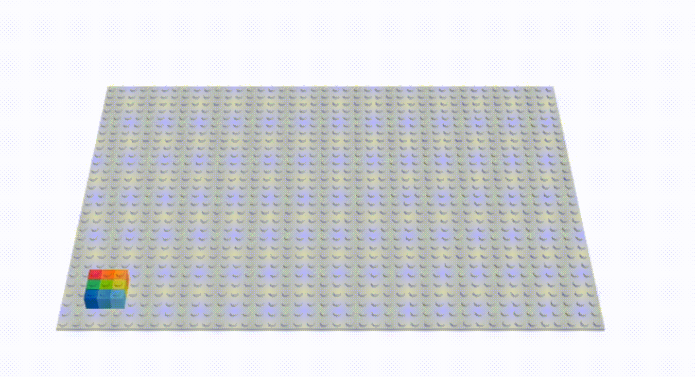
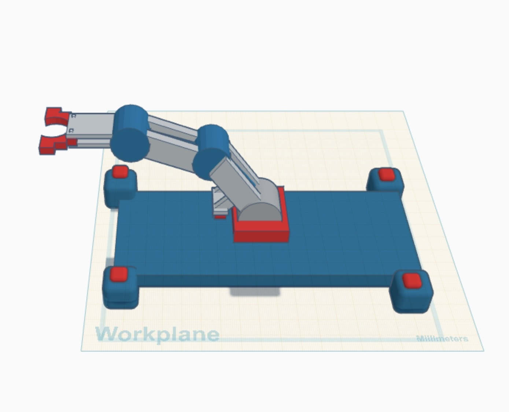
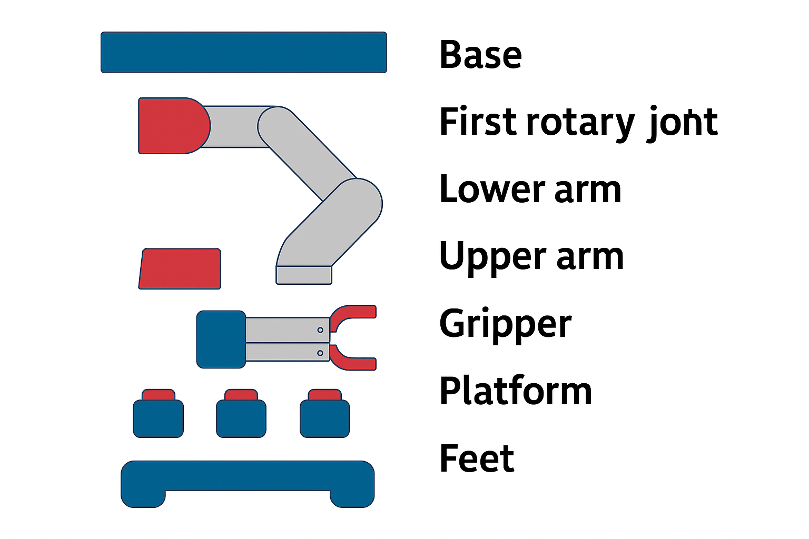

#   5 DOF Robotic Arm – TinkerCAD Design 🦾 : 
        

A fully 3D-designed 5 Degrees of Freedom (DOF) robotic arm built using [TinkerCAD](https://www.tinkercad.com/things/gCwtqTSA52X-cool-snicket). This model demonstrates the mechanical structure of a robotic arm capable of multi-directional movement and object manipulation using a claw-style end effector.


---

## 1.  Project Overview :

This robotic arm model was created as part of an academic assignment to design a mechanical manipulator with 5 degrees of freedom. It showcases the structure and joint architecture typically found in real-world robotic arms.

-  Platform: TinkerCAD (3D Design Only)
-  DOF: 5 (Base rotation + 3 arm joints + gripper)
-  Purpose: Educational & conceptual mechanical design

---

## 2.  Degrees of Freedom Explained : 

1. **Base Rotation (Yaw)** – Enables full rotation of the arm around the vertical axis.
2. **Shoulder Joint** – Allows up/down motion of the arm.
3. **Elbow Joint** – Provides further vertical extension and articulation.
4. **Wrist Joint** – Enables flexible wrist movement.
5. **Gripper (Claw)** – Opens and closes to pick or place objects.

---

## 3.  Preview :




---

## 4.  Components & Assembly :




|  Component             |  Description                                                            |  Purpose                                  |
|------------------------|------------------------------------------------------------------------|---------------------------------------------|
| **Base Platform**      | A stable and flat foundation to secure the robotic arm.                | Ensures structural stability and balance.   |
| **Rotary Base**        | A rotating mechanism allowing the entire arm to turn horizontally.     | Provides horizontal movement (yaw).         |
| **Arm Segments (x3)**   | Three connected segments with cylindrical joints.                     | Allows vertical movement and reach.         |
| **Gripper (End Effector)** | A claw-like structure with two fingers.                            | Enables the arm to pick and hold objects.   |
| **Corner Supports**     | Structural beams placed diagonally at the base.                       | Enhances rigidity and improves aesthetics.  |


## 5.  Objectives : 

- Understand the mechanical structure of multi-joint robotic systems.
- Learn how DOF contributes to range of motion and flexibility.
- Practice accurate 3D modeling with proper alignment and rotation.

---

## 6. Future Enhancements : 

- Add servo motor mounting placeholders for real-world prototyping.
- Animate the movement using TinkerCAD Circuits or external simulation tools.
- Export STL files for 3D printing.
- Integrate Arduino for full control of movement and automation.

---

## 7.  Files Included :


```Text 
 5-dof-arm-tinkercad/
├── README.md
├── Disgen.jpeg 
├── design_notes.txtt
└── STL Files 

```

---

## 8. Learnings & Challenges : 

- Precision in joint placement was crucial for realistic movement.
- Ensuring rotational clearance between parts required careful scaling.
- Layered design helped modularize each part of the arm.


